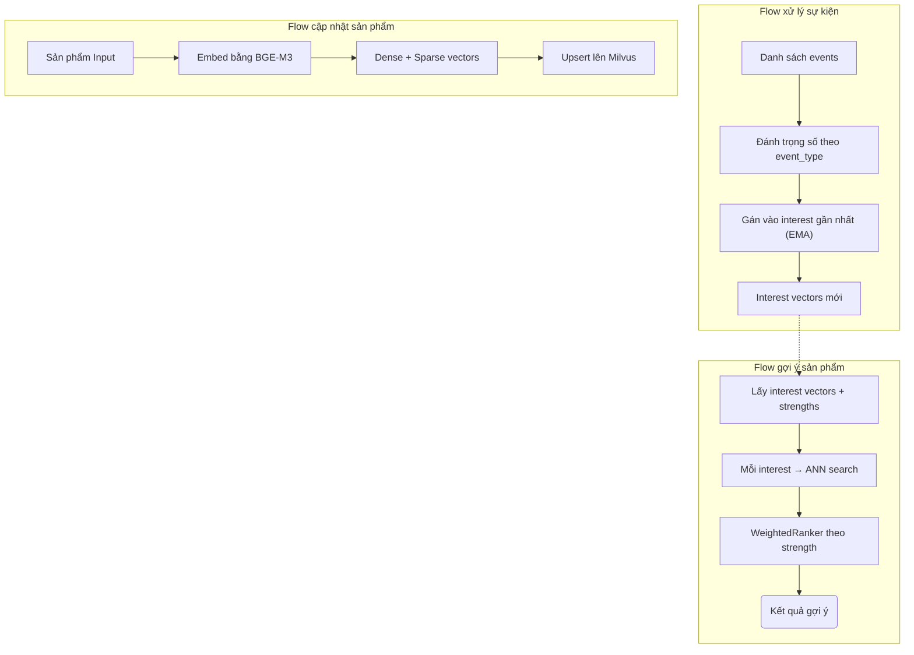

# ShopNexus Embedding

## 1. Tổng quan

Hệ thống embedding và vector search cho ShopNexus. Chịu trách nhiệm:
- **Embedding sản phẩm**: Chuyển đổi thông tin sản phẩm (tên, mô tả) thành dense + sparse vectors bằng BGE-M3.
- **Semantic search**: Tìm kiếm sản phẩm bằng hybrid search (ngữ nghĩa + từ khoá).
- **Multi-interest user model**: Biểu diễn sở thích người dùng bằng nhiều interest vectors, cập nhật real-time từ hành vi.
- **Interest-based recommendation**: Gợi ý sản phẩm dựa trên interest vectors qua ANN search trên Milvus.

## 2. Đặc trưng sở thích người dùng

Hệ thống sử dụng mô hình **BGE-M3** để tạo ra hai loại vector cho mỗi sản phẩm:

1. **Vector Dense (Ngữ nghĩa)**: Mô tả sản phẩm "là cái gì" ở mức ngữ nghĩa sâu. Ví dụ: "giày chạy bộ Nike" sẽ có vector gần với "giày thể thao Adidas" vì cùng thuộc nhóm giày vận động.

2. **Vector Sparse (Từ khoá)**: Mô tả sản phẩm dựa trên các từ khoá cụ thể. Giúp tìm kiếm chính xác khi người dùng nhập từ khoá đặc thù mà ngữ nghĩa không bắt được.

Mỗi người dùng được biểu diễn bằng **N slot sở thích** (mặc định 4). Mỗi slot gồm:
- **Interest vector**: Hướng trong không gian embedding, đại diện cho một nhóm sở thích (ví dụ: "giày thể thao", "điện thoại").
- **Strength**: Độ mạnh / độ tin cậy của sở thích đó, thể hiện mức độ tương tác tích luỹ.

## 3. Quy trình xử lý sự kiện

### Bước 1: Tiếp nhận và Đánh trọng số

Khi người dùng tương tác, hệ thống đánh giá mức độ quan trọng dựa trên **loại hành động**:

| Hành động | Trọng số | Ý nghĩa |
|-----------|----------|----------|
| Mua hàng | +0.8 | Tín hiệu tích cực mạnh nhất |
| Thêm yêu thích | +0.6 | Lưu vĩnh viễn — quan tâm cao |
| Thêm giỏ hàng | +0.5 | Ý định mạnh nhưng chưa cam kết |
| Xem sản phẩm | +0.3 | Quan tâm cơ bản |
| Báo cáo sản phẩm | -1.2 | Tín hiệu tiêu cực mạnh nhất |
| Trả hàng | -0.6 | Không hài lòng sau mua |
| Dislike | -0.5 | Không thích rõ ràng |

### Bước 2: Gán sở thích (Multi-Interest Assignment)

Sau khi tính trọng số, hệ thống quyết định **gán tương tác vào slot sở thích nào**:

1. **Tìm interest gần nhất**: So sánh vector sản phẩm với từng interest vector hiện tại bằng cosine similarity.

2. **Nếu đủ giống (similarity > ngưỡng)**: Hoà trộn vào interest đó bằng EMA (Exponential Moving Average). Sở thích cũ được "pha" với tín hiệu mới, giữ lại thói quen lâu dài nhưng vẫn phản ánh thay đổi gần đây.

3. **Nếu còn slot trống**: Tạo interest mới — hệ thống nhận ra bạn đang quan tâm đến một chủ đề hoàn toàn mới.

4. **Tất cả slot đầy, không giống cái nào**: Hoà trộn dần vào slot yếu nhất. Nếu bạn liên tục tương tác với chủ đề mới, slot yếu nhất sẽ dần chuyển sang chủ đề đó một cách tự nhiên.

### Bước 3: Xử lý tín hiệu tiêu cực

Khi người dùng thể hiện sự không hài lòng (trả hàng, dislike, báo cáo...), hệ thống không chỉ giảm độ mạnh của interest liên quan, mà còn **đẩy vector ra xa** khỏi sản phẩm đó. Nhờ vậy, lần gợi ý tiếp theo sẽ tránh xa loại sản phẩm gây khó chịu.

### Các cơ chế bảo vệ

| Vấn đề | Giải pháp |
|--------|-----------|
| Strength tăng vô hạn → interest cũ áp đảo | Giới hạn tại `MAX_STRENGTH = 20.0` |
| Interest vector bị "đông cứng" theo thời gian | `MIN_ALPHA = 0.05` đảm bảo mỗi tương tác dịch chuyển vector ít nhất 5% |
| Thay thế slot phá huỷ hoàn toàn sở thích cũ | EMA blend dần thay vì xoá trắng |
| Tín hiệu tiêu cực chỉ giảm strength | Đẩy vector ra xa sản phẩm tiêu cực |

## 4. Cơ chế gợi ý

Khi cần gợi ý sản phẩm cho người dùng, hệ thống:

1. **Lấy interest vectors**: Đọc tất cả interest vectors có strength > 0 từ Milvus.

2. **Hybrid search**: Mỗi interest tạo một truy vấn ANN (Approximate Nearest Neighbor) riêng trên collection sản phẩm.

3. **WeightedRanker**: Kết quả được xếp hạng theo strength đã normalize — interest mạnh hơn có ảnh hưởng lớn hơn trong kết quả cuối cùng.

4. **Filter**: Chỉ hiển thị sản phẩm đang hoạt động (`is_active = true`).

=> Kết quả: Danh sách sản phẩm phù hợp nhất với tổng hợp các sở thích của người dùng, ưu tiên sở thích mạnh hơn.

## 5. Sơ đồ luồng chi tiết

## 6. Cấu hình

| Tham số | Mặc định | Mô tả |
|---------|----------|-------|
| `NUM_INTERESTS` | 4 | Số slot sở thích mỗi người dùng |
| `MERGE_THRESHOLD` | 0.7 | Ngưỡng cosine similarity tối thiểu để hoà trộn vào interest |
| `MAX_STRENGTH` | 20.0 | Giới hạn trên của strength |
| `MIN_ALPHA` | 0.05 | Sàn của hệ số EMA alpha |
