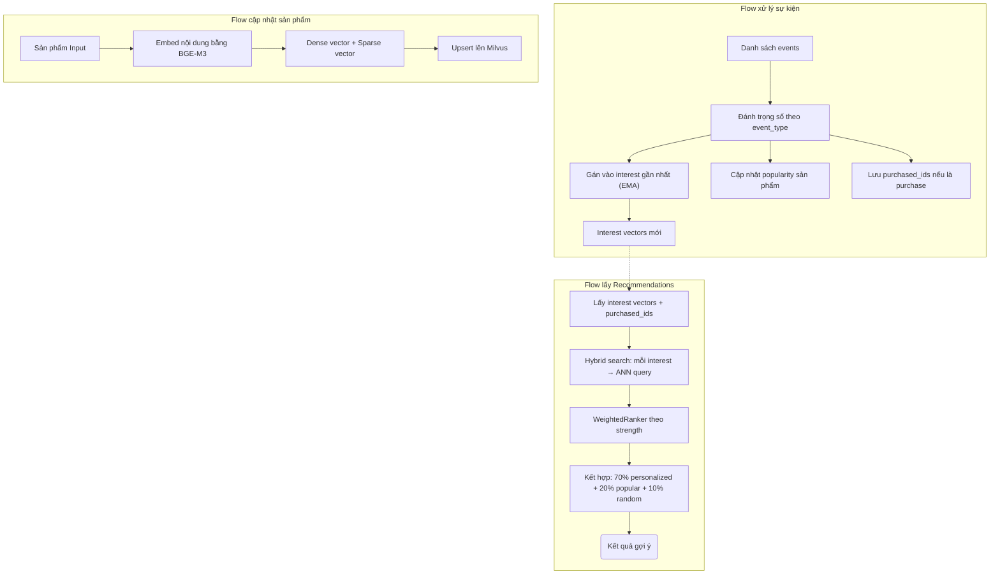

# Shopnexus Recommender

## 1. Tổng quan

Hệ thống hoạt động như một trợ lý ảo thông minh, liên tục quan sát hành vi của người dùng để xây dựng **nhiều "sở thích số"** (interest vectors) cho mỗi người. Thay vì chỉ có một vector đại diện duy nhất, mỗi người dùng được biểu diễn bằng nhiều vector độc lập — cho phép hệ thống hiểu rằng một người có thể vừa thích giày thể thao, vừa quan tâm đến điện thoại, vừa đang tìm đồ nội thất.

Điểm đặc biệt của hệ thống:
- **Học tập thời gian thực** (Online Learning): Ngay khi bạn vừa xem hoặc mua một món đồ, hệ thống lập tức cập nhật hiểu biết của nó về bạn, không cần huấn luyện lại mô hình.
- **Đa sở thích** (Multi-Interest): Mỗi người dùng có nhiều slot sở thích độc lập, gợi ý đa dạng thay vì lặp đi lặp lại cùng một chủ đề.
- **Khám phá** (Exploration): Kết quả gợi ý pha trộn giữa cá nhân hoá, sản phẩm phổ biến, và khám phá ngẫu nhiên.

## 2. Đặc trưng sở thích người dùng

Để máy tính xử lý được, mọi thứ đều được chuyển đổi thành các dãy số (gọi là **Vector**). Hệ thống sử dụng mô hình **BGE-M3** để tạo ra hai loại vector cho mỗi sản phẩm:

1. **Vector Dense (Ngữ nghĩa)**: Mô tả sản phẩm "là cái gì" ở mức ngữ nghĩa sâu. Ví dụ: "giày chạy bộ Nike" sẽ có vector gần với "giày thể thao Adidas" vì cùng thuộc nhóm giày vận động.

2. **Vector Sparse (Từ khoá)**: Mô tả sản phẩm dựa trên các từ khoá cụ thể. Giúp tìm kiếm chính xác khi người dùng nhập từ khoá đặc thù mà ngữ nghĩa không bắt được.

Mỗi người dùng được biểu diễn bằng **N slot sở thích** (mặc định 4). Mỗi slot gồm:
- **Interest vector**: Hướng trong không gian embedding, đại diện cho một nhóm sở thích (ví dụ: "giày thể thao", "điện thoại").
- **Strength**: Độ mạnh / độ tin cậy của sở thích đó, thể hiện mức độ tương tác tích luỹ.

## 3. Quy trình xử lý sự kiện

### Bước 1: Tiếp nhận và Đánh trọng số

Khi người dùng tương tác, hệ thống đánh giá mức độ quan trọng dựa trên **loại hành động**:

| Hành động | Trọng số | Ý nghĩa |
|-----------|----------|----------|
| Mua hàng | +0.8 | Tín hiệu tích cực mạnh nhất |
| Thêm yêu thích | +0.6 | Lưu vĩnh viễn — quan tâm cao |
| Thêm giỏ hàng | +0.5 | Ý định mạnh nhưng chưa cam kết |
| Xem sản phẩm | +0.3 | Quan tâm cơ bản |
| Báo cáo sản phẩm | -1.2 | Tín hiệu tiêu cực mạnh nhất |
| Trả hàng | -0.6 | Không hài lòng sau mua |
| Dislike | -0.5 | Không thích rõ ràng |

### Bước 2: Gán sở thích (Multi-Interest Assignment)

Sau khi tính trọng số, hệ thống quyết định **gán tương tác vào slot sở thích nào**:

1. **Tìm interest gần nhất**: So sánh vector sản phẩm với từng interest vector hiện tại bằng cosine similarity.

2. **Nếu đủ giống (similarity > ngưỡng)**: Hoà trộn vào interest đó bằng EMA (Exponential Moving Average). Sở thích cũ được "pha" với tín hiệu mới, giữ lại thói quen lâu dài nhưng vẫn phản ánh thay đổi gần đây.

3. **Nếu còn slot trống**: Tạo interest mới — hệ thống nhận ra bạn đang quan tâm đến một chủ đề hoàn toàn mới.

4. **Tất cả slot đầy, không giống cái nào**: Hoà trộn dần vào slot yếu nhất. Nếu bạn liên tục tương tác với chủ đề mới, slot yếu nhất sẽ dần chuyển sang chủ đề đó một cách tự nhiên.

### Bước 3: Xử lý tín hiệu tiêu cực

Khi người dùng thể hiện sự không hài lòng (trả hàng, dislike, báo cáo...), hệ thống không chỉ giảm độ mạnh của interest liên quan, mà còn **đẩy vector ra xa** khỏi sản phẩm đó. Nhờ vậy, lần gợi ý tiếp theo sẽ tránh xa loại sản phẩm gây khó chịu.

### Các cơ chế bảo vệ

| Vấn đề | Giải pháp |
|--------|-----------|
| Strength tăng vô hạn → interest cũ áp đảo | Giới hạn tại `MAX_STRENGTH = 20.0` |
| Interest vector bị "đông cứng" theo thời gian | `MIN_ALPHA = 0.05` đảm bảo mỗi tương tác dịch chuyển vector ít nhất 5% |
| Thay thế slot phá huỷ hoàn toàn sở thích cũ | EMA blend dần thay vì xoá trắng |
| Tín hiệu tiêu cực chỉ giảm strength | Đẩy vector ra xa sản phẩm tiêu cực |

## 4. Cơ chế gợi ý

Khi cần hiển thị sản phẩm cho bạn (ví dụ: ở trang chủ), hệ thống chia kết quả thành **ba nhóm**:

### Cá nhân hoá (70%)

Hệ thống lấy tất cả interest vectors có strength > 0, thực hiện **hybrid search** trên Milvus:
- Mỗi interest tạo một truy vấn ANN (Approximate Nearest Neighbor) riêng.
- Kết quả được xếp hạng bằng **WeightedRanker** theo strength — interest mạnh hơn có ảnh hưởng lớn hơn trong kết quả cuối cùng.
- Loại bỏ sản phẩm đã mua gần đây (lưu 10 sản phẩm gần nhất).
- Chỉ hiển thị sản phẩm đang hoạt động (`is_active = true`).

### Sản phẩm phổ biến (20%)

Lấy các sản phẩm có điểm popularity cao nhất, rồi **weighted random sampling** — sản phẩm càng popular càng có xác suất được chọn cao, nhưng vẫn có tính ngẫu nhiên để không lặp lại mãi cùng kết quả.

Điểm popularity được cập nhật mỗi khi có event mới:
```
popularity_mới = popularity_cũ × 0.95 + trọng_số_event
```

=> Sản phẩm trending sẽ có popularity cao, sản phẩm lâu không ai tương tác sẽ dần giảm.

### Khám phá ngẫu nhiên (10%)

Tạo một vector ngẫu nhiên rồi tìm sản phẩm gần nó nhất trong không gian embedding. Kết quả là những sản phẩm từ **vùng ngẫu nhiên** trong kho hàng — giúp người dùng khám phá những thứ ngoài sở thích hiện tại.

### Xử lý Cold-Start

Khi người dùng mới chưa có dữ liệu tương tác, hệ thống trả về toàn bộ sản phẩm phổ biến. Ngay khi có vài tương tác đầu tiên, interest vectors được tạo và hệ thống chuyển sang gợi ý cá nhân hoá.

## 5. Sơ đồ luồng chi tiết



## 6. Cấu hình

| Tham số | Mặc định | Mô tả |
|---------|----------|-------|
| `NUM_INTERESTS` | 4 | Số slot sở thích mỗi người dùng |
| `MERGE_THRESHOLD` | 0.7 | Ngưỡng cosine similarity tối thiểu để hoà trộn vào interest |
| `MAX_STRENGTH` | 20.0 | Giới hạn trên của strength |
| `MIN_ALPHA` | 0.05 | Sàn của hệ số EMA alpha |
| `MAX_PURCHASED_IDS` | 10 | Số sản phẩm đã mua lưu lại để loại trừ |
| `POPULARITY_DECAY` | 0.95 | Hệ số suy giảm cho popularity |
| `PERSONAL_RATIO` | 0.7 | Tỷ lệ slot cá nhân hoá |
| `POPULAR_RATIO` | 0.2 | Tỷ lệ slot phổ biến |
| `RANDOM_RATIO` | 0.1 | Tỷ lệ slot khám phá |
